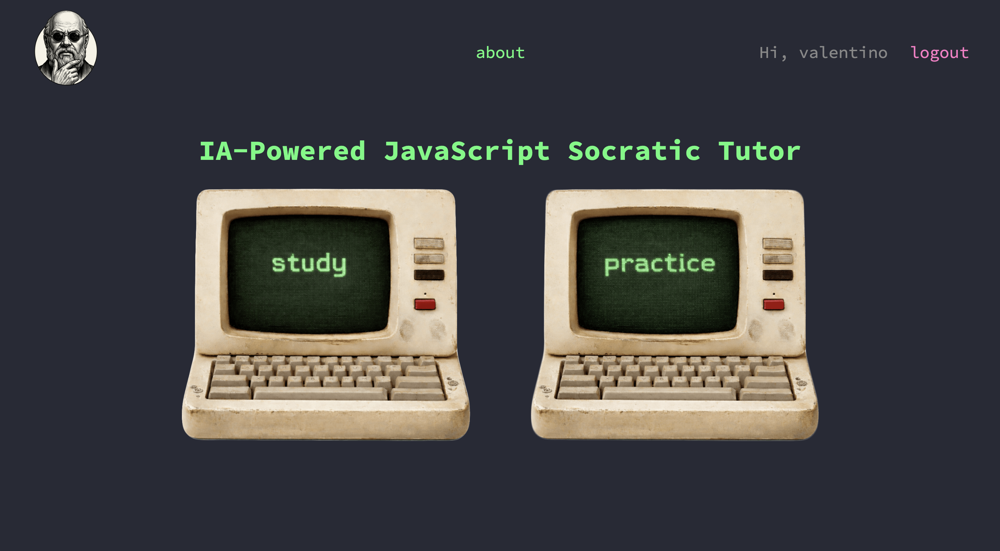

# SocraticJS

An AI-powered JavaScript learning platform that teaches through the Socratic method — guiding beginners to *discover* answers themselves rather than just reading explanations. Built with PHP, MySQL, and the Anthropic API.


---

## Table of Contents

1. [Design & Planning](#design--planning)
2. [Features](#features)
3. [Technologies Used](#technologies-used)
4. [Local Development](#local-development)
5. [Deployment](#deployment)
6. [Credits](#credits)

---

## Design & Planning

### User Stories

- As a new learner, I want to register an account so I can track my progress across sessions.
- As a learner, I want to select a JavaScript topic and be guided through it via Socratic questioning, so I understand it deeply rather than just memorising it.
- As a learner, I want to write JavaScript in an interactive editor and see the output immediately, so I can experiment and learn by doing.
- As a learner, I want an AI to review my code with guiding questions, so I can identify and fix issues myself.
- As a learner, I want to mark topics as studied or practiced, so I can see my progress across the 7-phase curriculum.
- As a learner, I want to choose between Study mode (pure JS) and Real mode (JS targeting HTML elements), so I can practice in a context that matches my current goals.

### Colour Scheme

SocraticJS uses a Dracula-inspired dark theme with two accent colours to distinguish the two learning modes:

| Token | Value | Usage |
|---|---|---|
| `--color-bg` | `#282a36` | Page background |
| `--color-tutor` | `#7C3AED` | JS Tutor (study) features |
| `--color-console` | `#0EA5E9` | JS Console (practice) features |
| `--color-green` | `#50fa7b` | Brand accent, navigation |
| `--color-text` | `#F0F0F0` | Body copy |

<!-- screenshot: colour palette swatches -->

### Typography

**Source Code Pro** (Google Fonts) is used throughout — a monospace font that reinforces the coding context and gives the UI a terminal aesthetic.

### Database Diagram

The schema follows a curriculum hierarchy: **Phase → Topic → Lesson**, with a separate **Exercise** model for coding challenges and **user_progress** tracking what each learner has completed.

Key relationships:
- A `phase` has many `topic`s; a `topic` has many `lesson`s.
- A `lesson` with `mode = 'practice'` can have one `exercise`.
- An `exercise` has many `check_rule`s (auto-grading expressions).
- A `user_progress` row per `(user, lesson)` tracks study completion.
- An `attempt` per `(user, exercise)` stores submitted code; each attempt can have one `ai_review`.

<!-- screenshot: ERD diagram from sql/schema.sql -->

---

## Features

### Socratic Tutor Chat

Pick any lesson from the 7-phase JavaScript roadmap and open a full-screen chat with an AI tutor. The tutor never gives answers directly — it asks guiding questions to help you think through the concept. The full conversation history is maintained so the model has complete context on every turn.

<!-- screenshot: tutor.php chat interface with a message exchange -->

### AI-Generated Coding Exercises

Click **New Challenge** in the JS Console and the Anthropic API generates a fresh exercise on the fly — including a task description, starter code, and auto-grading check rules. Every challenge is unique.

<!-- screenshot: consolenohtml.php or consolehtml.php with a loaded challenge -->

### Study Mode Console (Pure JS)

A focused coding environment with a CodeMirror editor, a sandboxed iframe for safe code execution, and an output panel that captures `console.log()` output and runs auto-checks. No HTML panel — the focus is purely on the JavaScript concept.

<!-- screenshot: consolenohtml.php with code and output visible -->

### Real Mode Console (JS + HTML)

A three-panel environment where the learner edits both HTML and JavaScript, then sees changes live in a preview iframe. The AI generates a meaningful HTML structure for the learner to target — just like working on a real project.

<!-- screenshot: consolehtml.php showing all three panels -->

### AI Code Review

After writing code in either console mode, click **Review my code** to receive Socratic feedback from Claude — questions that nudge you toward spotting your own issues, never a direct fix.

### Progress Tracking

Every topic link on the Study and Practice pages has a checkbox. Checking it saves progress to the database via a REST endpoint. On next visit, your completed topics are restored automatically.

<!-- screenshot: study.php with some checkboxes ticked -->

### Secure Authentication

Full registration and login flow with bcrypt password hashing (`password_hash`), prepared statements throughout to prevent SQL injection, session regeneration after login to prevent session fixation, and deliberately vague login error messages to prevent account enumeration.

---

## Technologies Used

- **PHP 8.3** — server-side rendering, session auth, API proxy
- **MySQL 8.0** — relational database for users, curriculum, and progress
- **Apache** (via `php:8.3-apache` Docker image) — web server with `mod_rewrite`
- **Docker & Docker Compose** — containerised local development environment
- **Anthropic Claude API** — Socratic tutor chat, exercise generation, code review
- **Vanilla JavaScript (ES5/ES6)** — all frontend interactivity, no framework
- **CodeMirror 5** — syntax-highlighted code editors (HTML and JS modes)

### Libraries

| Library | Version | Usage |
|---|---|---|
| CodeMirror | 5.65.16 | In-browser code editors with Dracula theme |
| Source Code Pro | Google Fonts | Monospace font throughout the UI |

---

## Local Development

### Prerequisites

- [Docker Desktop](https://www.docker.com/products/docker-desktop/)
- An Anthropic API key

### Setup

1. **Clone the repository**
   ```bash
   git clone https://github.com/your-username/socraticjs.git
   cd socraticjs
   ```

2. **Create a `.env` file** in the project root:
   ```env
   MYSQL_ROOT_PASSWORD=rootpassword
   MYSQL_DATABASE=jstutor
   MYSQL_USER=jstutor_user
   MYSQL_PASSWORD=jstutor_pass
   ANTHROPIC_API_KEY=sk-ant-...
   ```

3. **Start the containers**
   ```bash
   docker compose up --build
   ```

4. **Visit the app**
   - App: [http://localhost:8080](http://localhost:8080)
   - phpMyAdmin: [http://localhost:8081](http://localhost:8081)

The database schema and seed data (phases, topics, lessons) are applied automatically on first run from `docker/mysql/init/`.

> **Note:** The `users` table used by `register.php` and `login.php` lives in `docker/mysql/init/01_schema.sql`. The full ERD schema (with the lesson/exercise hierarchy) lives in `sql/schema.sql` — run this manually in phpMyAdmin if you want the complete data model.

---

## Deployment

### Environment Variables

The following environment variables are required in any deployment:

| Variable | Description |
|---|---|
| `MYSQL_ROOT_PASSWORD` | MySQL root password |
| `MYSQL_DATABASE` | Database name (`jstutor`) |
| `MYSQL_USER` | App database user |
| `MYSQL_PASSWORD` | App database user password |
| `ANTHROPIC_API_KEY` | Your Anthropic API key — injected into the PHP container |

The `ANTHROPIC_API_KEY` is passed to the PHP container via the `environment` block in `docker-compose.yml` and read in PHP using `getenv('ANTHROPIC_API_KEY')`. It is never exposed to the browser.

---

## Credits

- [Anthropic Claude API Documentation](https://docs.anthropic.com) — API reference for the Messages endpoint
- [CodeMirror 5 Documentation](https://codemirror.net/5/) — editor configuration and modes
- [PHP: password_hash](https://www.php.net/manual/en/function.password-hash.php) — bcrypt authentication
- [PDO Documentation](https://www.php.net/manual/en/book.pdo.php) — safe database access
- [Docker Documentation](https://docs.docker.com/) — containerised development setup
- [Dracula Theme](https://draculatheme.com/) — colour palette inspiration